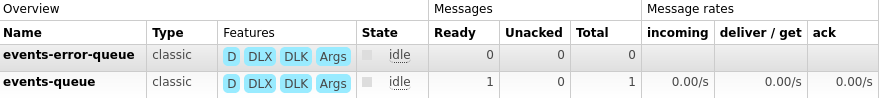

# Introduction
This blog is about the implementation of Guaranteed Delivery pattern via WSO2 Message Store and Message processor using RabbitMQ.

As the name suggests the pattern ensures guranteed delivery of a message from sender to its receiver. It is a well-known pattern in Enterprise Integration world for asynchronous messaging. More information about this pattern [here][linkToGDPattern]

# Overview

The message sender saves the message to a message-store rather directly sending it to the receiver endpoint. A message processor then pick-ups the message from message-store and tries to deliver it to the endpoint. If endpoint is unavailable or message delivery is unsuccessful then the message is stored to a failover-store. Hence, message is not lost and failover message processor then picks the message from failover-store and delivers it back to original message-store. This way the orginal message processor tries to deliver the message again untill delivery is successful.

# Pre-Reqs
In order to follow along through this tutorial, make sure following components are installed:

- WSO2 Micro-Integrator (v7.1.0)
- RabbitMQ (v3.8.x)

# Steps
Lets breakdown the steps to make it easier to develop the understanding of the implementation

- [Setup the Transport](#Setup-the-Transport) -
Transport Sender and Listener are required in wso2 in order to connect with RabbitMQ.
- [Create Message Stores and Message Processors](#Create-Message-Stores-and-Message-Processors) -
Two message processors are required i.e. one per each message store.
- [Create a Proxy-Service](#Create-a-Proxy-Service) -
A simple custom-proxy service to save the incoming message to the store
- [Create an Endpoint](#Create-an-Endpoint) -
An endpoint for a service that is going to act as a receiver.

## Setup the Transport
In order to setup the transport sender and listener for RabbitMQ, add the following configurations in the deployment.toml file located at ($MI_HOME/conf/deployment.toml) of WSO2 Micro-Integrator.

Save the configurations. Make sure RabbitMQ instance is running and start the Micro-Integrator.
You'll notice a connecton log in the console.

**_Note_** : In case your RabbitMQ instance has different _username_, _password_ or _port_, feel free to update the paramters in the configurations.

## Create Message Stores and Message Processors
One store is going to save the incoming messages and other store is going to save the failover messages (that were unable to reach the Enpoint) at RabbitMQ. So, lets call our main store as **_events-store_** and failover store as **_failover-events-store_**.

**_Note_**: The events-store has additional paramter of guaranteed delivery and name of failover store

**_events-store_**

**_failover-events-store_**

As we have setup our Message Stores, Its time to create a Message Processor for each store. The processor for events-store will be of
**_ScheduledMessageForwardingProcessor_** type and for the other Message Store, processor will be of **_FailoverScheduledMessageForwardingProcessor_** type.

So, lets call our main processor as **_events-processor_** and the other one as **_failover-events-processor_** in the same as we declared Message Stores.

**_events-processor_**

**_failover-events-processor_**

## Create a Proxy-Service
We need a simple Proxy-Service that can store the incoming messages to our events-store. So lets create a **_events-delivery-service_**

## Create an Endpoint
The last step is to create an Endpoint. The endpoint should points to the receiver backend. However, we want our message to go-through the failover store so that we stimulate guaranteed-delivery. So, we can declare the endpoint with a non-existing service.

**_events-delivery-endpoint_**

# Test
Now we have all the required components, all we need is to send a request to our **_events-delivery-service_**. Once, the request is sent you'll see the log inside Micro-Integrator console. The message is stored to **_events-store_**

You can also verify it from the RabbitMQ interface.

The **_events-processor_** then tries to deliver the message to the **_events-delivery-endpoint_** but since the endpoint is unavailable, the message is delivered to **_failover-events-store_**. The **_failover-events-processor_** then picks up the message from failover-store and deliver it back to **_events-store_**.

This way message is never lost due to the unavailability of backend and that's what guaranteed delivery pattern ensures. :)

# References:

[linkToGDPattern]: https://docs.wso2.com/display/IntegrationPatterns/Guaranteed+Delivery#df23c084462d4f90af10720f14686e46
